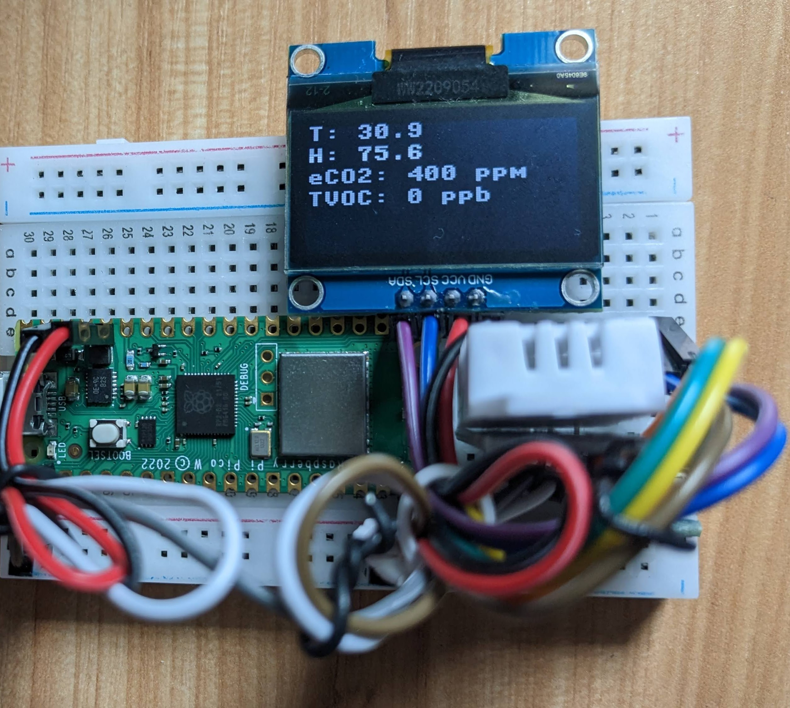

<h1 style="text-align:center;">Raspbery Pi Pico W Indoor Air Quality and Temperature Monitor</h1>
<br>
<br>
</img>
<br>
<br>
<h2 style='min-height:1px; background-color: #abebc6 ; padding: 0rem 1rem; color:#000'>Features</h2>
<ul> 
<li>Monitor Indor AQ with SGP30 Sensor</li>
<li>Monitor Temperature and Humidity with DHT22</li>
<li>Show sensors value on SH1106 1.3" OLED  screen</li>
<li>Send data to Azure IoT Central</li>
</ul>
<br>
<br>
<h2 style='min-height:1px; background-color: #abebc6 ; padding: 0rem 1rem; color:#000'>Packages and Dependencies</h2>
<ul> 
<li>upip</li>
<li>Micropython Azure IoTC (Read Notes)</li>
<li>Mircopython MQTT Simple and Robust 1.x (Read Notes)</li>
<li>SPG30 Adafruit</li>
<li>DHT22</li>
<li>SH1106</li>
</ul>
<br>
<br>
<h2 style='min-height:1px; background-color: #abebc6 ; padding: 0rem 1rem; color:#000'>Notes</h2>
<h3 style='font-weight:bold;'>Azure IoTC lib changes:</h3>
<p>When IoTC package is installed in Thonny, navigate to 'provision.py' file under /lib/iotc/ and change the API version</p> 
<p>from:</p>

```python
self._api_version = '2019-01-15' 
```

<p>to:</p>

```python
self._api_version = '2019-03-31' 
```

<h3 style='font-weight:bold;'>Micropython MQTT Robust 1.0:</h3>
<p>If you are facing issues installing micropython MQTT Robust 1.x from Thonny, use the one provided in this repo and maually install it from Thonny.</p> 
<br>
<br>
<h2 style='min-height:1px; background-color: #abebc6 ; padding: 0rem 1rem; color:#000'>Credits</h2>
<ul> 
<li>@deshipu and @robert-hh for SH1106</li>
<li>Daniel Perron for DHT22</li>
</ul>
